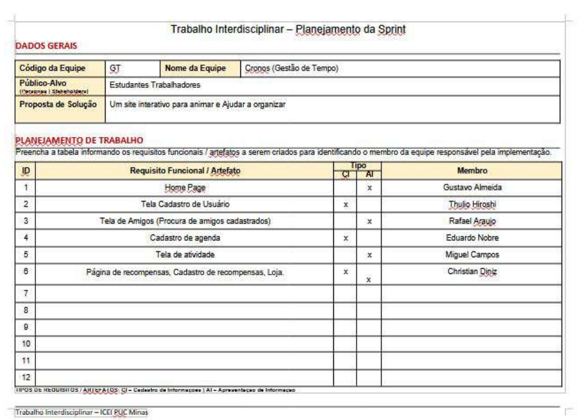

# Metodologia

Pré-requisitos: <a href="03-Product-design.md"> Product design</a>

Usamos a metodologia Kaban, o qual sempre nos comunicamos quando alguem ira mexer no repositorio 

## Relação de ambientes de trabalho

Os artefatos do projeto são desenvolvidos a partir de diversas plataformas. A relação dos ambientes com seus respectivos propósitos deverá ser apresentada em uma tabela que especifique e detalhe Ambiente, Plataforma e Link de Acesso. Defina também os ambientes e frameworks que serão utilizados no desenvolvimento de aplicações móveis.

> **Links úteis**:
> - [Tutorial GitHub](https://guides.github.com/activities/hello-world/)
> - [Git e GitHub](https://www.youtube.com/playlist?list=PLHz_AreHm4dm7ZULPAmadvNhH6vk9oNZA)
> - [Comparando fluxos de trabalho](https://www.atlassian.com/br/git/tutorials/comparing-workflows)
> - [Understanding the GitHub flow](https://guides.github.com/introduction/flow/)
> - [The gitflow workflow - in less than 5 mins](https://www.youtube.com/watch?v=1SXpE08hvGs)

###  Divisão de papéis

### Processo

> **Links úteis**:
> - [GitHub Projects - YouTube](https://www.youtube.com/playlist?list=PLiO7XHcmTsldZR93nkTFmmWbCEVF_8F5H)
> - [Planejamento e gestão ágil de projetos](https://pucminas.instructure.com/courses/87878/pages/unidade-2-tema-2-utilizacao-de-ferramentas-para-controle-de-versoes-de-software)
> - [Sobre quadros de projeto](https://docs.github.com/pt/issues/organizing-your-work-with-project-boards/managing-project-boards/about-project-boards)
> - [Project management, made simple](https://github.com/features/project-management/)
> - [Como criar backlogs no GitHub](https://www.youtube.com/watch?v=RXEy6CFu9Hk)
> - [Tutorial slack](https://slack.com/intl/en-br/)

### Ferramentas

| Ambiente                            | Plataforma                         | Link de acesso                                                                                    |
| Processo de Design Thinking         | Miro                               | https://miro.com/pt/signup/                                                                       |
| Repositório de código fonte         | GitHub                             | https://github.com/ICEI-PUC-Minas-PBE-ADS-SI/2025-1-p1-tiaw-gestao-de-tempo/tree/main/src         |
| Documentos do projeto               | GitHub                             | https://github.com/ICEI-PUC-Minas-PBE-ADS-SI/2025-1-p1-tiaw-gestao-de-tempo/tree/main/docs        |
| Gerenciamento do projeto            | GitHub Projects                    | https://github.com/orgs/ICEI-PUC-Minas-PBE-ADS-SI/projects/65                                     |
| Projeto de interface                | Figma                              | https://www.figma.com/design/NHJspbiAXXMgryIjO3T0R5/Chris1?node-id=0-1&p=f&t=Lk8Obqjw2pGwtjaD-0   |
 
