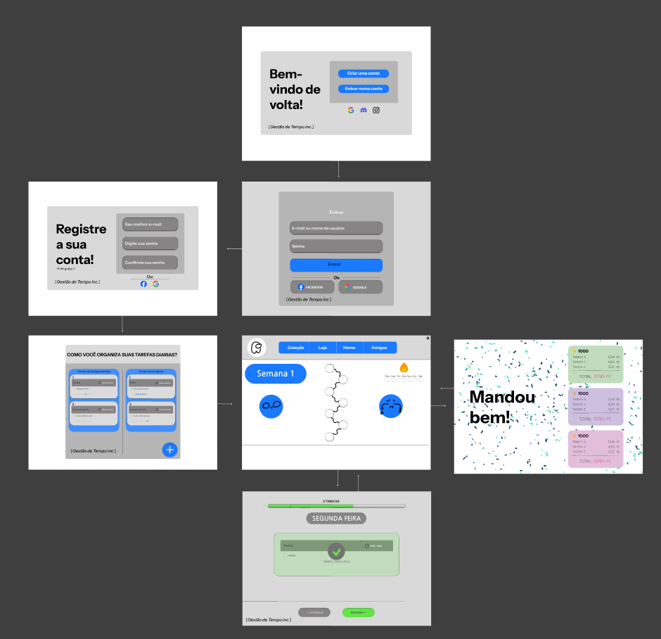

# Projeto de interface

Pré-requisitos: <a href="03-Product-design.md"> product design</a>

 Visão geral da interação do usuário pelas telas do sistema e protótipo interativo das telas com as funcionalidades que fazem parte do sistema (wireframes).

 Apresente as principais interfaces da plataforma. Discuta como ela foi elaborada de forma a atender os requisitos funcionais, não funcionais e histórias de usuário abordados na parte de <a href="03-Product-design.md"> product design</a>.

 ## User flow
.jpg)

Caminho do usuario

## Wireframes

.jpg)

Wireframe da pagina principal
 
### Protótipo Interativo

✅ [Protótipo interativo](https://www.figma.com/design/NHJspbiAXXMgryIjO3T0R5/Chris1?node-id=0-1&p=f&t=Lk8Obqjw2pGwtjaD-0)