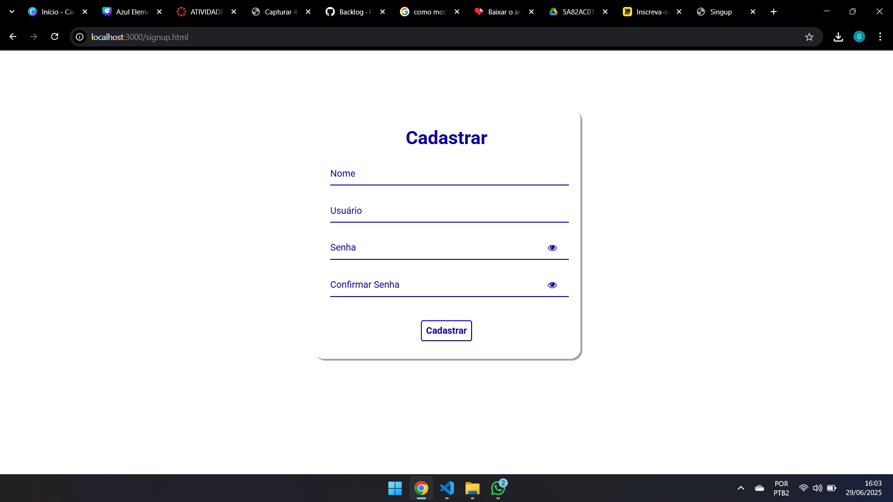

# Arquitetura da solução

<span style="color:red">Pré-requisitos: <a href="05-Projeto-interface.md"> Projeto de interface</a></span>

Definição de como o software é estruturado em termos dos componentes que fazem parte da solução e do ambiente de hospedagem da aplicação.

## Funcionalidades

Esta seção apresenta as funcionalidades da solução.

##### Funcionalidade 1 - Cadastro de Login

Permite a inclusão, leitura, alteração e exclusão de compromissos do usuario

* **Instruções de acesso:**
  * Abra o sire e selecione cadastra-se;
  * Inclua seus dados e depois clique em cadastrar;
  * Faça o login.
* **Tela da funcionalidade**:



##### Funcionalidade 1 - Cadastro de Agenda

Permite a inclusão, leitura, alteração e exclusão de compromissos do usuario

* **Instruções de acesso:**
  * Apos o login monte sua agenda;
  * Escolha o horario;
  * Salve no Final.
* **Tela da funcionalidade**:


### Estruturas de dados

Descrição das estruturas de dados utilizadas na solução com exemplos no formato JSON.Info.

##### Estrutura de dados - Usuários

Registro dos usuários do sistema utilizados para login e para o perfil do sistema.

```json
  {
      "nome": "Christian Diniz",
      "user": "kurisnya",
      "senha": "pepeanimal7",
      "id": 1
    }
```

##### Estrutura de dados - Tarefa

Registro dos usuários do sistema utilizados para login e para o perfil do sistema.

```json
  {
      "nome": "asas",
      "inicio": "10:00",
      "fim": "11:00",
      "necessario": false,
      "obs": "",
      "dia": "dom",
      "id": 1
    }